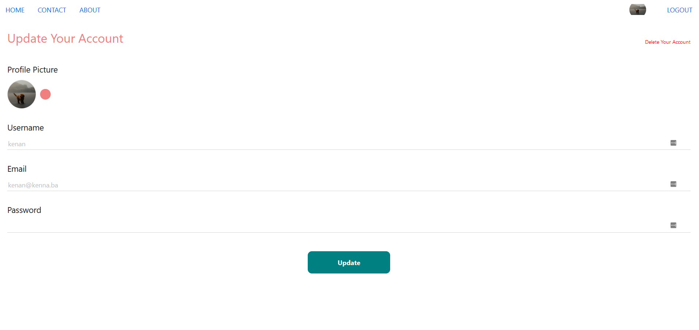

<div id="top"></div>

<!-- PROJECT LOGO -->
<br />
<div align="center">
<h3 align="center">News Blog</h3>

  <p align="center">
    News web site with various functionalities
    <br />
    <a href="https://github.com/github_username/repo_name">View Demo</a>
    ·
  </p>
</div>


<!-- TABLE OF CONTENTS -->
<details>
  <summary>Table of Contents</summary>
  <ol>
    <li>
      <a href="#about-the-project">About The Project</a>
      <ul>
        <li><a href="#built-with">Built With</a></li>
      </ul>
    </li>
    <li>
      <a href="#getting-started">Getting Started</a>
      <ul>
        <li><a href="#prerequisites">Prerequisites</a></li>
        <li><a href="#installation">Installation</a></li>
      </ul>
    </li>
    <li><a href="#usage">Usage</a></li>
  </ol>
</details>


<!-- ABOUT THE PROJECT -->
## About The Project
News web site where you can view posted news as a guest by default, or comment on posts if You register a profile. After You are registered as a user, you need to wait for admin to activate Your profile. After You are activated as a user, You get a premission to comment under posts.
Logging in as an admin lets you post news, delete or edit them. Also, admin can delete comments and activate or deactivate users. (If you want to try admin mode, use credentials admin-admin).

<p align="right">(<a href="#top">back to top</a>)</p>


### Built With

* [Node.js](https://nodejs.org/)
* [Express](https://expressjs.com/)
* [MongoDB](https://www.mongodb.com/)
* [React.js](https://reactjs.org/)
* [Bootstrap](https://getbootstrap.com)


<p align="right">(<a href="#top">back to top</a>)</p>


<!-- GETTING STARTED -->
## Getting Started

### Prerequisites

* npm
  ```sh
  npm install npm@latest -g
  ```

### Installation

1. Clone the repo
   ```sh
   git clone https://github.com/kenangenjac/news-web-app.git
   ```
2. Install NPM packages in client folder
   ```sh
   npm install
   ```
3. Install NPM packages in server folder
   ```sh
   npm install
   ```
4. Start client
   ```sh
   npm start
   ```
5. Start server
   ```sh
   node index
   ```
   or
   ```sh
   npm run watch
   ```
   to use nodemon
6. Enter your MongoDB connection string in server/index.js if you want to work with Your db, or check the deployment to see the already connected project
   ```js
   const URI = 'your_conn_string';
   ```
  

<p align="right">(<a href="#top">back to top</a>)</p>


## Usage
Some screenshots from the website
<div align="center">  
  <p align="left">Login screen</p>
  <a>
    
  </a>
</div>

<br/>
<div align="center">
  <p align="left">User panel after login</p>
  <a>
    
  </a>
</div>

<br/>
<div align="center">
  <p align="left">Single post and comment section</p>
  <a>
    
  </a>
  <a>
    
  </a>
</div>

<br/>
<div align="center">
  <p align="left">Update account screen</p>
  <a>
    
  </a>
</div>

<br/>
<div align="center">
  <p align="left">User activation and deactivation in admin mode</p>
  <a>
    
  </a>
</div>

<br/>
<div align="center">
  <p align="left">Writing a post in admin mode</p>
  <a>
    
  </a>
</div>

<p align="right">(<a href="#top">back to top</a>)</p>
